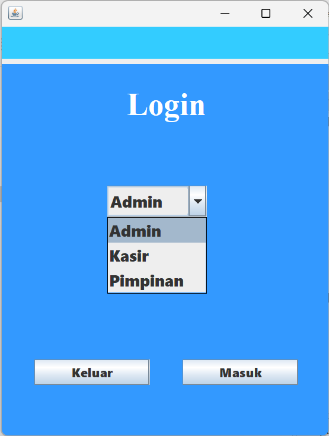
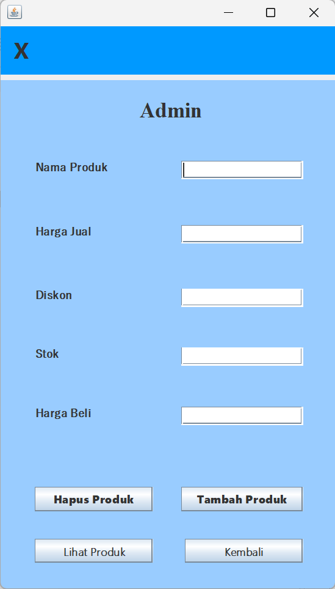
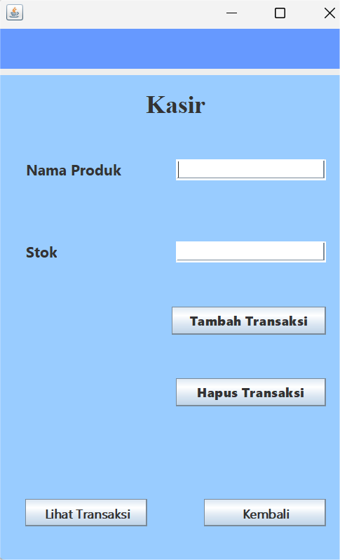
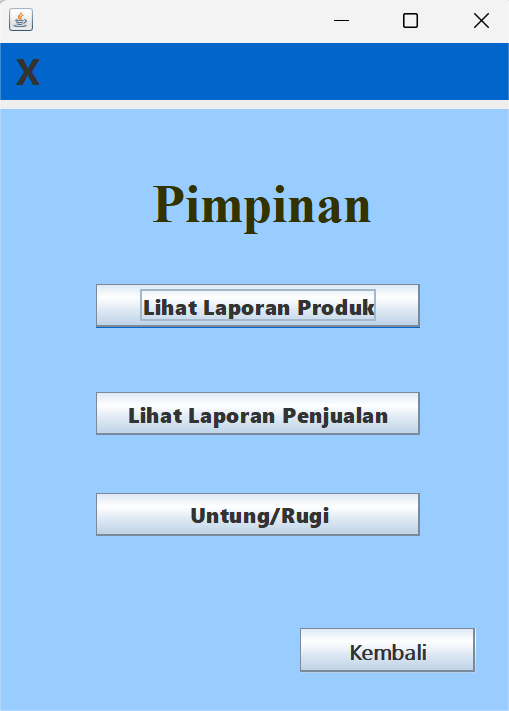

 # Aplikasi Penjualan Produk

### Deskripsi Singkat
Aplikasi Penjualan Produk adalah program berbasis Java yang mengimplementasikan konsep **Object-Oriented Programming (OOP)** dan menggunakan **SQLite** untuk penyimpanan data permanen. Aplikasi ini adalah sistem yang memfasilitasi proses transaksi antara penjual dan pembeli melalui platform digital. Aplikasi ini menyediakan berbagai fitur untuk mengelola barang yang dijual, melakukan transaksi pembelian, serta menyediakan laporan penjualan. Aplikasi ini terdiri dari tiga peran utama: **Admin**, **Kasir**, dan **Pimpinan**, yang masing-masing memiliki akses dan fitur berbeda sesuai fungsinya.

---

### Fitur Utama

### A. Login
- Pengguna memilih untuk masuk sebagai **Admin**, **Kasir**, atau **Pimpinan**.
- Setiap peran memiliki fitur berbeda.

### 🧑‍💼 UI Login



### B. Admin  (Kelola produk)
1. Menambahkan Produk ke Database
   > Jika nama produk yang ditambahkan sudah ada, maka data produk tersebut akan di-update, bukan ditambahkan dua kali.
   > Admin dapat mengatur nama produk, diskon, harga beli, dan harga jual.
   > Pastikan harga yang dimasukkan berupa angka (integer), tanpa huruf atau simbol lainnya.
   > Mengatur Informasi Produk
2. Menghapus Produk
   > Jika suatu produk dihapus, maka semua transaksi yang berkaitan dengan produk tersebut juga akan ikut terhapus.
   > Untuk menghapus produk, pastikan nama produk yang dimasukkan sama persis seperti di database, termasuk penggunaan huruf kapital dan kecil.
3. Melihat Daftar Produk
   > Admin dapat melihat daftar produk secara lengkap, termasuk tanggal dan waktu aktivitas terakhir.
4. Menyimpan Data Produk
   > Semua data produk disimpan secara permanen di dalam database SQLite.

### 🧾 UI Admin



### C. Kasir (Lakukan dan kelola transaksi)
1. Melakukan transaksi penjualan.
2. Mengurangi stok produk secara otomatis setelah transaksi berhasil.
3. Menghapus transaksi  
   > Jika transaksi dihapus, stok produk akan dikembalikan sesuai jumlah yang terjual.
4. Melihat aktivitas transaksi lengkap dengan tanggal dan jam.
5. Menyimpan transaksi ke database permanen (SQLite).

### 📦 UI Kasir


### D. Pimpinan (Akses laporan dan analisis)
1. Melihat laporan transaksi bulanan.
2. Melihat laporan pengeluaran bulanan.
3. Menghitung total pendapatan bersih dari penjualan.


### 📊 UI Pimpinan


### - Database
1. Penyimpanan data produk dan transaksi secara permanen menggunakan **SQLite**.
2. Otomatis membuat tabel `produk` dan `transaksi` saat aplikasi pertama kali dijalankan jika belum ada menggunakan file .db.
   
---
### query SQL (Structured Query Language)
Query SQL (Structured Query Language) adalah perintah yang digunakan untuk berinteraksi dengan database, baik untuk membuat struktur database, memasukkan, mengambil, memperbarui, maupun menghapus data. 

### ✅ Jenis Query SQL yang Digunakan
🔷 DDL (Data Definition Language)
- Digunakan untuk mendefinisikan struktur tabel dalam database.
1. CREATE TABLE – Membuat tabel produk dan transaksi.

🔷 DML (Data Manipulation Language)
- Digunakan untuk manipulasi data dalam tabel.
1. INSERT INTO – Menambahkan data ke tabel produk dan transaksi.
2. UPDATE – Memperbarui data produk jika nama produk sudah ada.
3. DELETE FROM – Menghapus produk atau transaksi berdasarkan kondisi tertentu.

🔷 DQL (Data Query Language)
- Digunakan untuk mengambil data dari database.
1. SELECT – Menampilkan data produk, transaksi, dan laporan keuangan.


### 🗃️ Struktur Tabel dalam Kode

```java
private static void createTablesIfNotExist() {
    String createProduk = """
    CREATE TABLE IF NOT EXISTS produk (
        nama TEXT PRIMARY KEY,
        harga REAL NOT NULL,
        stok INTEGER NOT NULL,
        diskon REAL DEFAULT 0,
        tanggal TEXT,
        hargaBeli REAL
    );
    """;

    String createTransaksi = """
    CREATE TABLE IF NOT EXISTS transaksi (
        id_produk TEXT NOT NULL,
        jumlah INTEGER NOT NULL,
        total_harga REAL NOT NULL,
        tanggal TEXT,
        FOREIGN KEY(id_produk) REFERENCES produk(nama)
    );
    """;
}

```


Penjelasan:
1. Tabel produk menyimpan informasi produk seperti nama, harga, stok, diskon, tanggal aktivitas, dan harga beli.
2. Tabel transaksi mencatat transaksi penjualan, termasuk produk terkait, jumlah yang dibeli, total harga, dan tanggal transaksi.

     
---

### Struktur Folder
```
Aplikasi_JualBeli/
└── src/  
    ├── app/
    │   └── Main.java
    ├── gui/
    │   ├── AdminFrame.java
    │   ├── KasirFrame.java
    │   ├── LoginFrame.java
    │   └── PimpinanFrame.java
    ├── model/
    │   ├── Produk.java
    │   ├── ProdukDiskon.java
    │   ├── ProdukInterface.java
    │   └── Transaksi.java
    └── service/
        └── Database.java

```
## 🧩 Struktur Class

Proyek ini menggunakan pendekatan **Pemrograman Berorientasi Objek (OOP)** dan dibagi dalam beberapa package berikut:

### 📁 app

- **Main**
  - Fungsi: Entry point program.
  - Menjalankan `LoginFrame` sebagai tampilan awal aplikasi.


### 📁 gui

Komponen GUI menggunakan Java Swing untuk tiap peran pengguna:

- **LoginFrame**
  - Menyediakan antarmuka login.
  - Menentukan role: Admin, Kasir, atau Pimpinan.

- **AdminFrame**
  - Tampilan untuk Admin.
  - Fitur: Menambah, mengedit, dan menghapus produk.

- **KasirFrame**
  - Tampilan untuk Kasir.
  - Fitur: Menampilkan daftar produk dan melakukan transaksi penjualan.

- **PimpinanFrame**
  - Tampilan untuk Pimpinan toko.
  - Fitur: Melihat laporan penjualan dan data produk.


### 📁 model

Berisi representasi objek utama dalam aplikasi:

- **Produk**
  - Atribut: `id`, `nama`, `harga`, `stok`.
  - Metode: `getHarga()`, `getStok()`, dll.
  - Constructor digunakan untuk inisialisasi objek.

- **ProdukDiskon** *(extends Produk)*
  - Menambahkan atribut `diskon`.
  - Override metode `getHarga()` untuk perhitungan diskon berdasarkan nilai diskon.

- **ProdukInterface**
  - Interface untuk mendefinisikan metode umum seperti `getNama()`, `getHarga()`, dll.
  - Digunakan untuk menyatukan kontrak antar class produk.

- **Transaksi**
  - Mewakili satu transaksi penjualan.
  - Atribut: daftar produk yang dibeli, total harga, dan waktu transaksi.
  - Menyediakan metode untuk menghitung total dan mencetak informasi transaksi.


### 📁 service

- **Database**
  - Bertindak sebagai penyimpanan data (produk dan transaksi).
  - Menyediakan metode: `addProduk()`, `getProduk()`, `addTransaksi()`, dll.
  - Mendukung koneksi ke SQLite sebagai penyimpanan permanen.

---

## 🎯 Penerapan Prinsip OOP

Struktur ini memenuhi prinsip-prinsip dasar OOP, yaitu:

- **Object & Class**  
  Setiap fitur direpresentasikan sebagai class dan digunakan melalui object, seperti `Produk`, `Transaksi`, dan berbagai Frame GUI.

- **Attribute, Behavior & Constructor**  
  Setiap class memiliki atribut (data), perilaku (method), dan constructor untuk inisialisasi objek, misalnya class `Produk` memiliki atribut `nama`, `harga`, dan method `getHarga()`.

- **Encapsulation**  
  Atribut dibuat private dan diakses melalui getter/setter untuk menjaga integritas data.

- **Inheritance**  
  Class `ProdukDiskon` mewarisi `Produk` dan memperluas fungsionalitasnya dengan menambahkan diskon.

- **Abstraction & Interface**  
  Interface `ProdukInterface` digunakan untuk mendefinisikan metode yang harus dimiliki oleh semua produk, tanpa mengetahui implementasinya secara spesifik.

- **Polymorphism**  
  Objek bertipe `Produk` bisa berupa `Produk` atau `ProdukDiskon`, dan method seperti `getHarga()` akan berjalan sesuai class aslinya (overriding).


---
### 🚀 Cara Menjalankan Aplikasi
1. Pastikan Anda telah menginstal Java JDK dan NetBeans (atau IDE lain seperti IntelliJ IDEA atau Eclipse).
2. Clone repositori melalui Command Prompt: git clone https://github.com/Mirnafebriasari/Aplikasi_JualBeli.git
3. Alternatif lain (lebih mudah): Klik tombol Code → Download ZIP, kemudian ekstrak file ZIP ke folder pilihan Anda.
4. Buka proyek di IDE, lalu pastikan file sqlite-jdbc.jar telah ditambahkan ke library proyek (Libraries → Add JAR/Folder).
5. Jalankan file Main.java dari IDE.
6. Saat dijalankan pertama kali, program akan otomatis membuat file database.db di folder resources/ jika belum ada.
---


### 📌 Pembagian Tugas Per Anggota
👩‍💻 FEMILIA PADAUNAN (H071241012)

Bertanggung jawab dalam membuat dan mengelola class Produk dan ProdukDiskon, yang merupakan inti dari pengelolaan data produk dalam aplikasi. Tugas ini mencakup perancangan atribut dan method untuk menyimpan data produk serta produk yang memiliki diskon, termasuk logika perhitungan harga akhir setelah diskon. Ia juga memastikan bahwa struktur class telah mengikuti prinsip-prinsip Object-Oriented Programming (OOP) dan dapat terintegrasi dengan lancar ke seluruh fitur aplikasi, khususnya dalam modul Admin dan Kasir.

🗃️ MIRNA FEBRIASARI (H071241078)

Bertanggung jawab penuh dalam pengelolaan penyimpanan data menggunakan SQLite. Ia membuat dan mengatur class Database.java, merancang struktur tabel produk dan transaksi, serta mengatur koneksi antar class dan database agar penyimpanan data bersifat permanen.
Selain itu, Mirna menangani dokumentasi proyek di GitHub, seperti unggah proyek, struktur direktori, file .gitignore, dan README.md. Ia juga berperan dalam melakukan pengujian akhir seluruh fitur, memastikan tidak ada bug sebelum aplikasi dirilis.

🖼️ NAYLA ZAKY FAUZIAH (H071241064)

Bertanggung jawab dalam merancang dan membangun antarmuka grafis (GUI) untuk peran Admin dan Kasir, menggunakan editor GUI berbasis drag-and-drop di NetBeans. Ia membuat file .java dan .form yang memuat elemen seperti tombol, form input, tabel, dan area aktivitas. Nayla memastikan bahwa tampilan antarmuka intuitif, responsif, dan sesuai alur penggunaan aplikasi, termasuk interaksi dengan database serta validasi data input.

🔐 SITI NUR HALISA TAHIR (H071241086)

Mengembangkan fitur untuk role Pimpinan dan Login, mencakup sistem autentikasi login pengguna berdasarkan peran, akses ke laporan transaksi dan pengeluaran bulanan, serta fitur perhitungan total pendapatan bersih. Ia juga menangani logika penambahan transaksi penjualan, penghapusan transaksi, dan pengurangan stok produk secara otomatis setelah transaksi berhasil. Semua fitur ini dikembangkan dengan memperhatikan konsistensi data dan validasi proses bisnis.

🧾 SYAHRANI ZAKIYAH NURFAIZAH (H071241042)

Bertanggung jawab atas pembuatan dan pengelolaan class ProdukInterface dan Transaksi. Ia menyusun kontrak interface untuk mengatur standar perilaku class produk, lalu mengimplementasikannya dalam class-class turunan. Syahrani juga membangun logika transaksi pembelian, termasuk pencatatan pembelian, perhitungan total harga, dan pengelolaan data transaksi yang terhubung dengan stok produk. Ia memastikan setiap proses transaksi berjalan sesuai prosedur aplikasi dan prinsip OOP.


